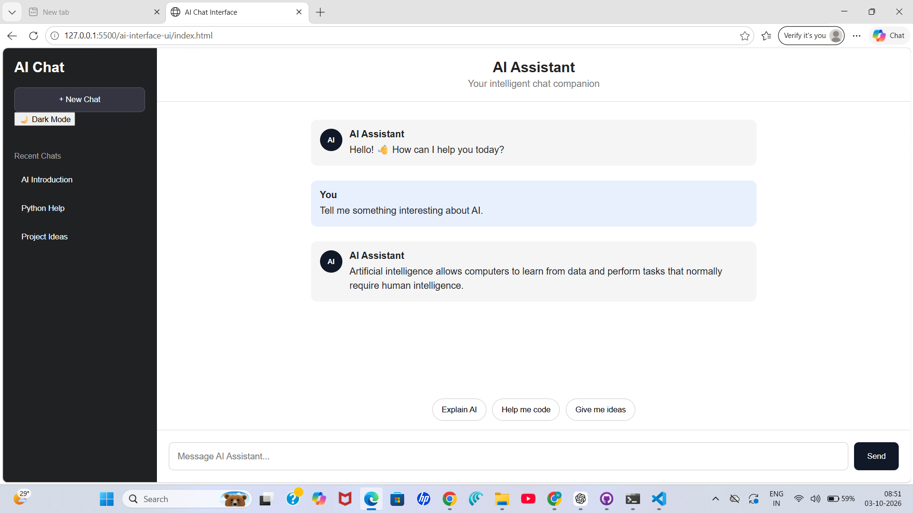
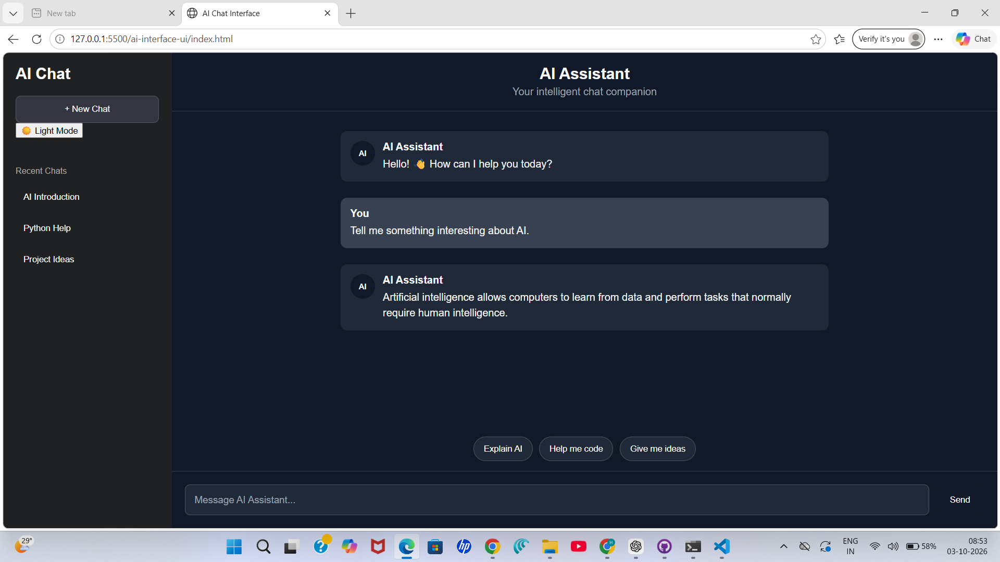

# AI Chat Interface

## UI Template Collection Hackathon

### Topic
AI Interfaces

### UI Pattern
AI Chat Interface

## About the Project

This project is a modern AI Chat Interface created using HTML, CSS, and JavaScript.

The interface provides a simple chat experience where users can send messages, view AI responses, use suggested prompts, switch between light and dark mode, start a new chat, and open recent conversations.

## Features

- AI chat interface
- User and AI message bubbles
- Dynamic responses based on user input
- Typing indicator
- Send button
- Enter key support
- Suggested prompt buttons
- Recent chat section
- New Chat button
- Light and Dark mode
- Responsive layout for smaller screens

## Technologies Used

- HTML5
- CSS3
- JavaScript

## Design and Interaction

The interface uses a sidebar for recent conversations and a main area for chatting.

The design includes:

- Clear separation between user and AI messages
- Simple navigation through recent chats
- Suggested prompts for easier interaction
- Dark and light themes
- Responsive layout
- Clean and readable interface

## Where This UI Can Be Used

An AI Chat Interface can be used in:

- AI assistants
- Student learning applications
- Coding assistants
- Customer support systems
- Productivity applications
- AI-powered web applications

## Project Structure

```text
ai-interface-ui/
│
├── index.html
├── style.css
├── script.js
└── README.md
## Screenshots

### Light Mode



### Dark Mode


## How to Run

1. Download or clone the repository.
2. Open the project folder.
3. Open `index.html` in a web browser.
4. Start interacting with the AI Chat Interface.

## Implementation

The interface is implemented using plain HTML, CSS, and JavaScript without external libraries or frameworks.

JavaScript handles:

- Sending messages
- Generating demo AI responses
- Showing the typing indicator
- Clearing the chat
- Opening recent conversations
- Suggested prompts
- Light/Dark mode switching

## Note

The AI responses in this project are frontend demo responses based on predefined JavaScript logic. This project does not currently connect to an external AI API or backend.